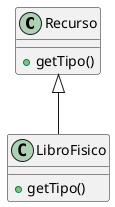

# Sistema de Biblioteca Digital

## Compilar y ejecutar
```bash
mkdir build && cd build
cmake ..
make
./biblioteca
```

## Módulos implementados
1. **Catálogo**
   - Patrón: Factory Method
   - Archivos: `src/catalogo/Recurso*`

## Diagrama de implementación
